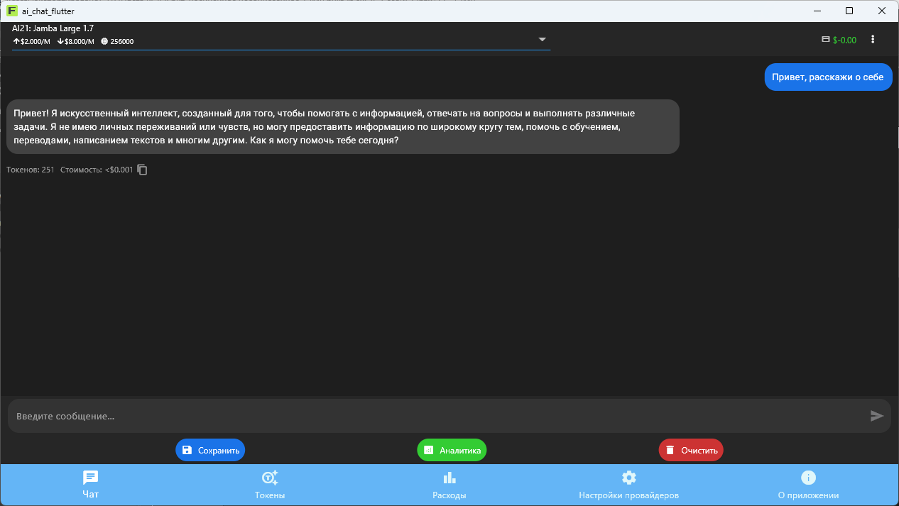
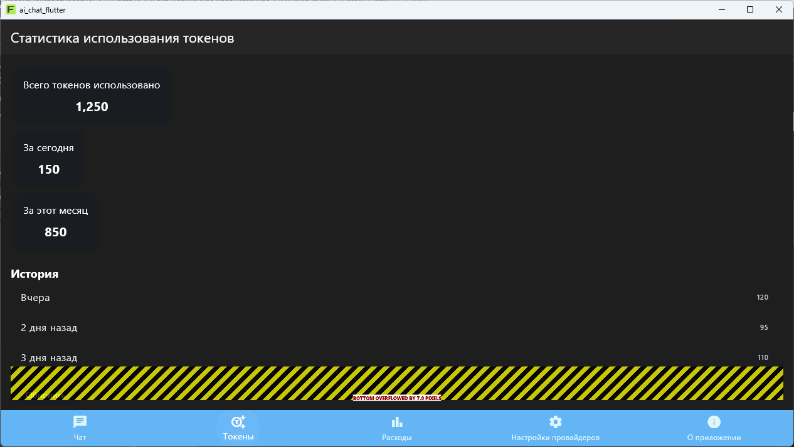
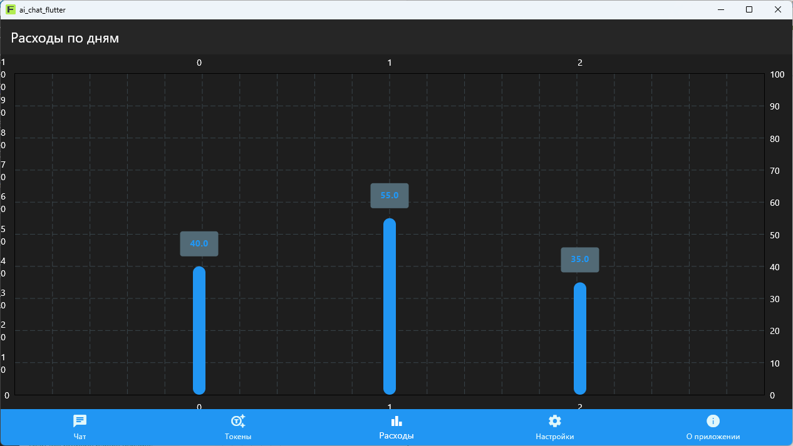
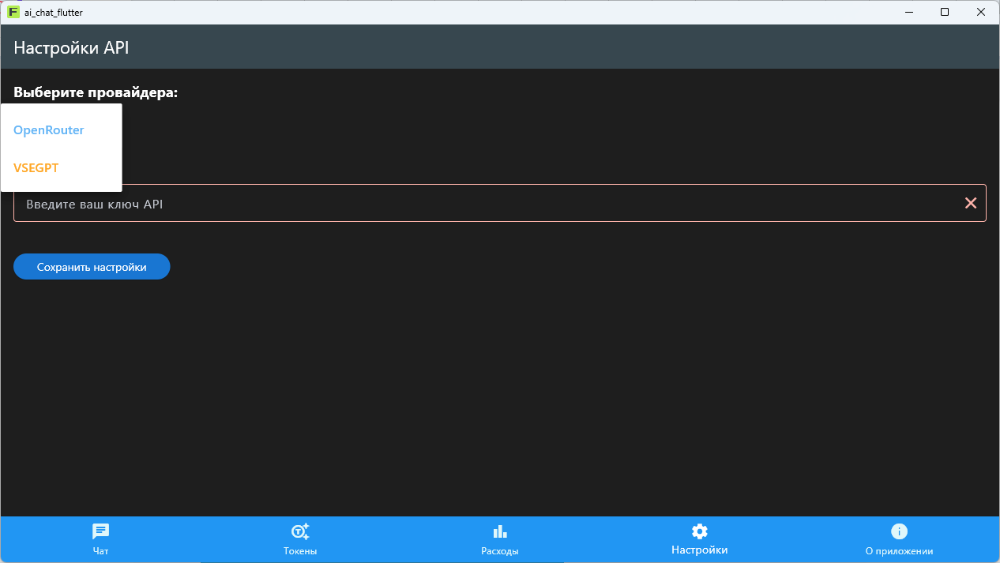
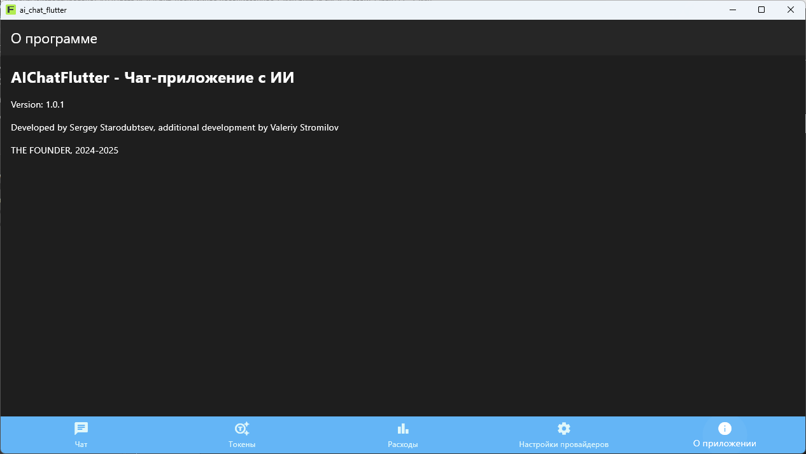

# AIChatFlutter - Чат-приложение с ИИ (UPDATE)
Обновление приложения было выполнено в рамках 52 задания курса «Разработчик нейросетей» от THE FOUNDER в октябре 2025 г.

## ✅ Основные изменения
* Добавлены новые страницы:
    * Настройка провайдера (OpenRouter или VSEGPT) и ввод ключа API;
    * Статистика использования токенов;
    * График расходов на модель;
    * Информация о приложении и авторах.
* Перемещение между разделами осуществляется при помощи нижней панели (`Bottom Navigation Bar`).

## 📂 Структура
Новые страницы добавлены в папку `screens`, где содержится и страница с чатом, все картинки и данная справка находятся в корневой директории. Для настроек в папку `providers` добавлен соответствующий провайдер. Таким образом, структура стала выглядеть следующим образом:

```
├── lib/                            # Основной код приложения
│   ├── UPDATE.MD                   # Справка об обновлении
│   └── chat.png                    # Один из скришнотов
<...>
├── providers/                      # State management
│   ├── chat_provider.dart          # Провайдер для управления состоянием чата
│   └── settings_provider.dart      # Провайдер для настроек API
│   └── expense_provider.dart       # Провайдер для расчёта расходов
├── screens/                        # Экраны приложения
│   ├── about_screen.dart           # О приложении
│   └── chat_screen.dart            # Основной экран чата
│   └── expense_chart_screen.dart   # График расходов
│   └── settings_screen.dart        # Настройка провайдера
│   └── tokens_screen.dart          # Использование токенов
│   └── tok_scr_wrong.dart          # Другая версия страницы с токенами
```


## ⚙️ Использованные технологии
* Cline;
* Модели нейросетей с OpenRouter:
    * [DeepSeek V3.1](https://openrouter.ai/deepseek/deepseek-chat-v3.1);
    * [MoonshotAI: Kimi Dev 72B](https://openrouter.ai/moonshotai/kimi-dev-72b).

Обратите внимание, что указанные ссылки на могут меняться со временем, и разработчики будут стараться поддерживать их актуальность.

## ⚠️ Возникшие проблемы и их возможные решения
Изначально при создании страницы со статистикой использования токенов (`TokensScreen`) были использованы заглушки вместо реальных значений вычисляемых токенов. Однако после добавления собственно подсчётов приложение перестало запускаться, и в терминале стали появляться многочисленные ошибки.

В частности, после запуска приложения стало появляться следующее уведомление: `Dart DevTools exited with code 3221226505. Would you like to try again?`.

Причины подобного мне пока не ясны (хотя, вероятно, это может быть связано с чрезмерным потреблением ресурсов или ошбикой компиляции), поэтому было решено «откатиться» до версии с заглушками (код страницы с подсчётом токенов со внесёнными изменениями представлен в файле `tok_scr_wrong.dart`). В будущем я планирую всё-таки довести дело до ума и разобраться с подсчётом токенов.

## 🖼️ Галерея

Окно с чатом | Окно со статистикой токенов | Окно с графиком расходов | Настройки провайдера | О приложении
:-------------------------:|:-------------------------:|:-------------------------:|:-------------------------:|:-------------------------:
 |  |  |  | 
